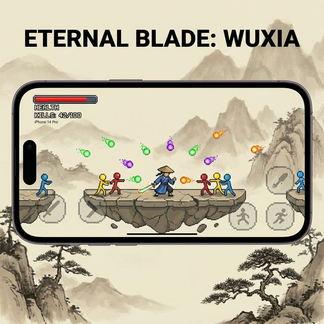

# 🗡 斗罗大桥：像素剑影

> **Douluo Bridge: Pixel Sword** — 中国水墨风武侠横版动作游戏 (iOS)


## 🎮 游戏简介

《斗罗大桥：像素剑影》是一款融合**中国传统水墨画风**与**像素武侠**元素的横版动作游戏。玩家扮演一位剑客，在水墨山水间斩妖除魔，修炼境界，最终达到剑神圆满。

### ✨ 核心特色

- 🎨 **水墨画风** — 宣纸底色、层叠远山、飘渺云雾、石桥平台
- ⚔️ **五种敌人** — 侦察兵、追击者、武术家（功夫连招）、重甲兵、狙击手
- 🥋 **武术家怪物** — 马步冲拳、侧踢、旋风扫腿、升龙拳
- 🔫 **360° 射击** — 敌人全方位瞄准，彩色弹幕
- 🗡 **杀·冲锋** — 路径上所有敌人一击必杀，3 秒冷却
- 🔥 **自动射击** — 玩家自动发射子弹，武器随等级进化
- 🎵 **古典BGM** — 程序生成的中国五声音阶古筝旋律（沧海一声笑、高山流水等经典曲风）
- 📳 **触觉反馈** — iOS 原生震动：命中、击杀、冲锋、必杀技

### 🏯 境界系统

| 等级 | 境界 | 武器特性 |
|------|------|----------|
| Lv.1 | 初入江湖 | 单发直线 |
| Lv.2 | 炼体 | 追击者出现 |
| Lv.3 | 筑基 | 武术家出现 |
| Lv.4 | 金丹 | 三向散射 |
| Lv.6 | 化神 | 狙击手出现 |
| Lv.7 | 合体 | 五向扇形 |
| Lv.10 | 剑神圆满 | 全向弹幕 + 霓虹特效 |

## 🏗 技术架构

```
┌─────────────────────────────────────┐
│         iOS Native Layer            │
│  GameViewController.swift           │
│  ├── WKWebView (游戏渲染)           │
│  ├── VirtualJoystick (虚拟摇杆)     │
│  ├── ActionButton × 4 (动作按钮)    │
│  └── Haptic Feedback (震动反馈)     │
├─────────────────────────────────────┤
│         JavaScript Bridge           │
│  window.iosSetKey(code, pressed)    │
│  webkit.messageHandlers.haptic      │
├─────────────────────────────────────┤
│         Game Engine (HTML5)         │
│  douluo_ios.html                    │
│  ├── Canvas 2D 渲染 (1600×900)     │
│  ├── 水墨背景系统                    │
│  ├── 敌人 AI + 武术家系统           │
│  ├── Web Audio BGM 生成器           │
│  └── 物理 + 碰撞系统               │
└─────────────────────────────────────┘
```

### 混合架构

- **游戏逻辑**：HTML5 Canvas + JavaScript，运行在 `WKWebView` 中
- **原生控制**：Swift UIKit 虚拟摇杆和动作按钮覆盖在 WebView 上
- **通信桥接**：通过 `window.iosSetKey()` 传递按键事件，通过 `WKScriptMessageHandler` 触发原生震动

### 技术栈

| 层级 | 技术 |
|------|------|
| 平台 | iOS 16.0+ |
| 语言 | Swift 5 + JavaScript |
| 渲染 | HTML5 Canvas 2D |
| 音频 | Web Audio API |
| 震动 | UIImpactFeedbackGenerator |
| UI | UIKit (原生控件) |

## 📱 截图



## 🚀 构建与运行

### 环境要求

- Xcode 15+
- iOS 16.0+ 模拟器或真机
- macOS Ventura+

### 步骤

```bash
# 1. 克隆仓库
git clone https://github.com/pemagic/DouluoBridge.git

# 2. 打开 Xcode 项目
open DouluoBridge/DouluoBridge.xcodeproj

# 3. 选择目标设备，点击 Run (⌘R)
```

## 📂 项目结构

```
DouluoBridge/
├── DouluoBridge.xcodeproj/     # Xcode 项目配置
├── DouluoBridge/
│   ├── douluo_ios.html         # 游戏核心 (JS + Canvas)
│   ├── GameViewController.swift # 主控制器 (WebView + 原生控件)
│   ├── VirtualJoystick.swift   # 虚拟摇杆组件
│   ├── ActionButton.swift      # 动作按钮组件
│   ├── AppDelegate.swift       # 应用生命周期
│   ├── SceneDelegate.swift     # 场景管理
│   ├── Info.plist              # 应用配置
│   ├── LaunchImage.png         # 启动画面
│   └── Assets.xcassets/        # 应用图标等资源
├── screenshot_gameplay.png     # 商店截图
└── README.md
```

## 🎮 操控方式

| 操作 | iOS 控件 | 键盘 (调试) |
|------|----------|------------|
| 移动 | 虚拟摇杆 | A/D 或 ←/→ |
| 跳跃 | ⬆ 跳 按钮 | Space / J |
| 攻击 | ⚔️ 攻击 (自动) | K |
| 杀·冲锋 | 🗡 杀 按钮 | Shift |
| 必杀技 | ⚡ 必杀 按钮 | L |

## 🔒 隐私政策

本游戏**不收集任何个人信息**。详见 [隐私政策](PRIVACY_POLICY.md)。

## 📜 开源协议

MIT License

---

**斗罗大桥：像素剑影** — 水墨江湖，剑影纵横 🗡
